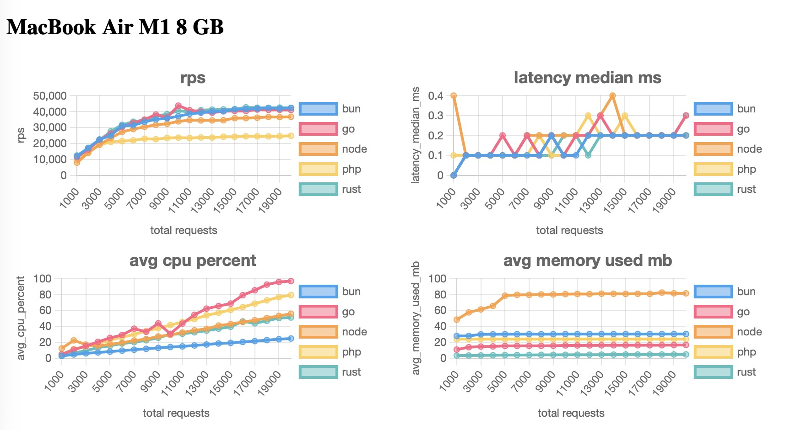

# Simple web server benchmark comparison


> Don't forget to hit the star if it's interesting! ⭐

- Go
- Rust (Hyper)
- Bun
- Node
- PHP (Development Server)

Results for `MacBook Air M1 8 GB` https://stan-kondrat.github.io/simple-web-server-benchmark-comparison/




## How to run local

```sh
# Install dependencies (macOS)
brew install make go rust bun node php

# Prepare virtual env
source myenv/bin/activate
pip install -r requirements.txt
deactivate

# clean, build and run all
make 

# view results
open ./docs/index.html
```

## Development
```sh
python3 -m venv myenv
source myenv/bin/activate
pip install psutil
pip freeze > requirements.txt
pip install -r requirements.txt

node main.js # or any 
./bench_runner.py <PID>
htop --pid <PID>

# available commands

make clean # clean all
make clean-go
make clean-rust
make clean-results

make build # build all
make build-go
make build-rust

make run # run all
make run-bun
make run-go
make run-node
make run-php
make run-rust
```

## Why  
Simply for fun and education!  

Inspired by [Anton Putra's tutorials](https://github.com/antonputra/tutorials)

## Contribution

This project can definitely be improved, and your ideas are welcome! 
Feel free to share them, open an issue, or just give the project a star. ⭐
